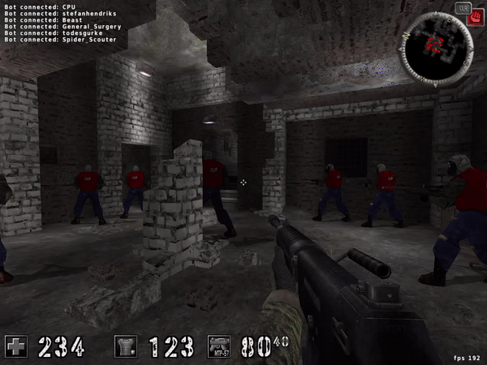

# assultCube Hacks

The hacks that I made:
* aimbot
* values hacks
	1. keep your health up to 234
	2. keep your ammo up to 50
	3. keep your shield up to 123
* show enemys players on map
* every time you get hitten, your health increseing by one
* teleport and switch places with closest enemy players

## Why I made this project
**I made this prjoect only for studying purposes**
I learned about operating systems, different types of computer memory, cool tactics like dll injection 
and I wanted to see what I can do with this knowlege.
I loved video games, and I read that doing cheats for video games can be fun and educational.
I searched for old video games that doesn't have anticheat, and found this game.

## How to install the project
```bash
git clone https://github.com/guykrinsky/assult_cube.git
```

## How to use
First you need to download the game [to the game website](https://assault.cubers.net/download.html)
The only thing you need to change before using the code is the variable PATH_TO_DLL in injectDll file.
after changing the path to the specific path to the dll in your computer, you ready to go.
Run the assultCube, and get in a game (I don't sure if the hack is working on free for all so chose team death mach).
inject the dll to the running game, ano **boom** you've start the hack.

## Gameplay
